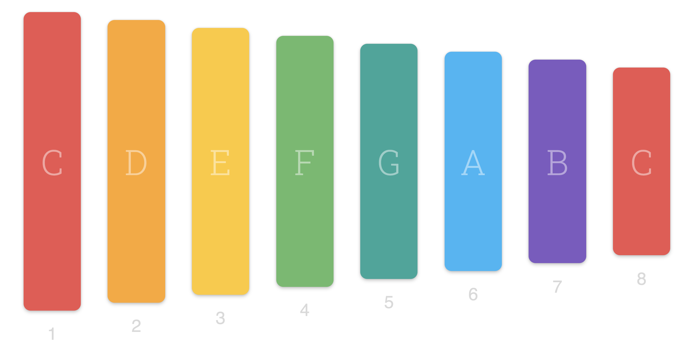

# Xylophone React App

When we click on any of the bars it should play a sound. You can play any online Xylophone to figure out how to do this.

The sounds will be added under `public/assets` folder in a React project